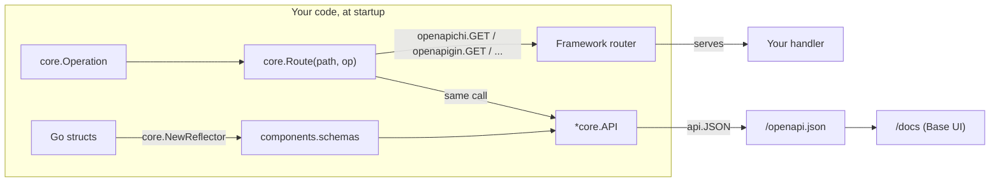

# go-openapi

Code-first OpenAPI documents for Go, with an interactive docs UI built in.

[](LICENSE)
[](https://pkg.go.dev/github.com/thebases/go-openapi/core)
[](https://github.com/thebases/go-openapi/blob/master/go.mod)

You describe each endpoint in Go, next to the handler that serves it. `go-openapi` builds the OpenAPI document from those descriptions and serves it at `/openapi.json`, with a browsable docs page at `/docs`. The spec is generated from your code, so it can't drift out of date.

- **Code-first:** no YAML to maintain and no code generation step.
- **Framework-neutral core:** optional helpers for Chi, Gin, Fiber (v2 and v3), Echo, and Iris register a route and document it in one call.
- **OpenAPI 3.0.4, 3.1.1, and 3.2.0:** 3.2.0 is the default.
- **Struct reflection:** turns your Go request/response types into schemas, with struct tags for descriptions, examples, enums, and validation limits.
- **Built-in docs UI:** three providers, all embedded in the binary. `core.DocsBase` is the one used in this guide. It has a Try-It panel, an Authorize dialog, Markdown descriptions, and Mermaid diagrams, and it works offline.
- **No generator dependencies:** written from scratch on the Go standard library. Framework dependencies are only pulled in by the integration you import.

---

## Contents

- [Requirements](#requirements)
- [Install](#install)
- [Quick start](#quick-start)
- [How it fits together](#how-it-fits-together)
- [Step-by-step guide](#step-by-step-guide)
  - [1. Create the API document](#1-create-the-api-document)
  - [2. Define schemas](#2-define-schemas)
  - [3. Describe operations](#3-describe-operations)
  - [4. Add authentication](#4-add-authentication)
  - [5. Register routes with your framework](#5-register-routes-with-your-framework)
  - [6. Group and nest routes](#6-group-and-nest-routes)
  - [7. Serve the docs UI](#7-serve-the-docs-ui)
  - [8. Choose an OpenAPI version](#8-choose-an-openapi-version)
  - [9. Export the spec](#9-export-the-spec)
- [Production notes](#production-notes)
- [Troubleshooting](#troubleshooting)
- [Packages](#packages)
- [Examples](#examples)
- [Development and releases](#development-and-releases)
- [Changelog](#changelog)
- [License](#license)

---

## Requirements

- Go **1.25** or newer.
- For route registration helpers: an application using Chi, Gin, Fiber v2/v3, Echo, or Iris. Without a framework, you can use `core` with plain `net/http`.

## Install

```bash
go get github.com/thebases/go-openapi
```

This single module holds every package. Import only what you need:

```go
import (
	core "github.com/thebases/go-openapi/core"                   // always
	openapichi "github.com/thebases/go-openapi/integrations/chi" // optional: one per framework
)
```

> The first time you import an integration, run `go mod tidy` with network access so Go can download that framework.

---

## Quick start

A complete, runnable Chi service with one documented endpoint and the Base docs UI:

```go
package main

import (
	"encoding/json"
	"log"
	"net/http"

	"github.com/go-chi/chi/v5"
	core "github.com/thebases/go-openapi/core"
	openapichi "github.com/thebases/go-openapi/integrations/chi"
)

func main() {
	router := chi.NewRouter()

	// One API document per service, created once at startup.
	// WithDocStyle turns on automatic /docs and /openapi.json routes.
	api := core.New(
		core.WithTitle("Merchant API"),
		core.WithVersion("1.0.0"),
		core.WithServer("http://localhost:3000", "Local"),
		core.WithDocStyle(core.DocsBase),
	)

	// Describe the endpoint: its inputs and possible responses.
	getMerchant := core.Operation{
		OperationID: "getMerchant",
		Summary:     "Get a merchant by ID",
		Parameters: []core.ParameterOrReference{
			core.PathParameter("id", core.StringSchema()),
		},
		Responses: map[string]core.ResponseOrReference{
			"200": core.JSONResponse("Merchant found", core.StringSchema()),
		},
	}

	// Register the Chi route and the OpenAPI operation in one call.
	err := openapichi.GET(router, api, core.Route("/merchants/{id}", getMerchant),
		func(w http.ResponseWriter, r *http.Request) {
			w.Header().Set("Content-Type", "application/json")
			_ = json.NewEncoder(w).Encode("merchant " + chi.URLParam(r, "id"))
		})
	if err != nil {
		log.Fatal(err)
	}

	log.Println("docs: http://localhost:3000/docs/")
	log.Fatal(http.ListenAndServe(":3000", router))
}
```

Run it:

```bash
go mod init example.com/merchant && go mod tidy
go run .
```

Then open:

| URL | What you get |
| --- | --- |
| <http://localhost:3000/docs/> | The Base docs UI. Pick **Get a merchant by ID** and use **Try it** to call the live handler. |
| <http://localhost:3000/openapi.json> | The generated OpenAPI 3.2.0 document. |

Next, [step 2](#2-define-schemas) replaces `core.StringSchema()` with a schema generated from a real Go struct.

---

## How it fits together



| Concept | Type | Role |
| --- | --- | --- |
| API document | `*core.API` | Holds the whole spec. Create one per service with `core.New(...)`. Safe to share between goroutines. |
| Schema | `*core.SchemaOrReference` | The shape of a request or response body. Write it by hand, or generate it from a struct. |
| Operation | `core.Operation` | One endpoint: summary, parameters, request body, responses, security. |
| Route spec | `core.RouteSpec` | A path plus an operation, created with `core.Route(path, op)`. The HTTP method comes from the helper you call, such as `GET`. |
| Integration | `integrations/<framework>` | Registers the real route on your router and the operation on the API in one step. It also converts path syntax, so `:id` and `{id:int}` both become `{id}`. |
| Docs UI | `core.DocsBase`, `core.DocsSwagger`, `core.DocsScalar` | HTML front ends that render `/openapi.json`. |

---

## Step-by-step guide

### 1. Create the API document

```go
api := core.New(
	core.WithTitle("Merchant API"),
	core.WithVersion("1.0.0"),
	core.WithDescription("descriptions/api.md"), // plain text, or a path to a .md file
	core.WithServer("https://api.example.com", "Production"),
	core.WithServer("http://localhost:3000", "Local"),
	core.WithDocStyle(core.DocsBase),
)
```

| Option | Effect | Default |
| --- | --- | --- |
| `WithTitle(s)` | `info.title`, also used as the docs page title | `"API"` |
| `WithVersion(s)` | `info.version`, the version of *your* API (not the OpenAPI version) | `"0.0.0"` |
| `WithDescription(s)` | `info.description`. Markdown is rendered by the Base UI. See [Markdown descriptions](#markdown-descriptions). | empty |
| `WithServer(url, desc)` | Adds an entry to `servers`. Call it once per environment. The Try-It panel sends requests to the server you select. | none |
| `WithDocStyle(p)` | Turns on automatic `/docs` and `/openapi.json` and picks the UI provider | off |
| `WithCustomCSS(css)` | Extra CSS for every docs mount | none |
| `WithOpenAPIVersion(n)` | `0` = 3.0.4, `1` = 3.1.1, `2` = 3.2.0 | `2` |

### 2. Define schemas

A schema is the shape of a JSON body. There are two ways to create one.

#### Option A: generate from Go structs (recommended)

Your struct stays the single source of truth for both the JSON payload and the docs.

```go
type Merchant struct {
	ID     string  `json:"id" description:"Merchant identifier" example:"m_123" readOnly:"true"`
	Name   string  `json:"name" description:"Display name" minLength:"1" maxLength:"120"`
	Status string  `json:"status" enum:"active,suspended" default:"active"`
	Email  string  `json:"email,omitempty" format:"email"`
	Parent *string `json:"parentId"` // pointer: nullable and optional
}

reflector := core.NewReflector()
merchantSchema, err := reflector.ReflectType(reflect.TypeOf(Merchant{}))
if err != nil {
	log.Fatal(err)
}

// The reflector collects every named struct it saw, including nested ones.
// Register them all so each $ref resolves.
for name, schema := range reflector.Components {
	if err := api.RegisterSchema(name, schema); err != nil {
		log.Fatal(err)
	}
}
// merchantSchema is now {"$ref": "#/components/schemas/Merchant"}
```

Go types map to schemas as follows:

| Go type | Schema |
| --- | --- |
| `string` | `string` |
| `bool` | `boolean` |
| `int`, `int8`–`int32` / `int64` | `integer` with format `int32` / `int64` |
| `uint*` | `integer` with `minimum: 0` |
| `float32` / `float64` | `number` with format `float` / `double` |
| `[]byte` | `string` with format `byte` (base64) |
| `[]T`, `[N]T` | `array` (fixed arrays also get `minItems`/`maxItems`) |
| `map[string]T` | `object` with `additionalProperties` |
| `time.Time` | `string` with format `date-time` |
| types implementing `encoding.TextUnmarshaler` | `string` |
| `*T` | `T`, nullable |
| named struct | a `$ref` to `components.schemas.<TypeName>` |
| `any` / interface | an empty schema (any value) |

Supported struct tags:

| Tag | Example | Effect |
| --- | --- | --- |
| `json` | `json:"name,omitempty"` | Property name. `-` skips the field. |
| `description` | `description:"Display name"` | Property description |
| `example`, `default` | `example:"42"` | Converted to the property's type |
| `enum` | `enum:"active,suspended"` | Comma-separated list of allowed string values |
| `format` | `format:"email"` | `format` keyword |
| `minimum`, `maximum` | `minimum:"0"` | Numeric limits |
| `minLength`, `maxLength`, `pattern` | `pattern:"^m_"` | String limits |
| `readOnly`, `writeOnly`, `deprecated`, `nullable` | `readOnly:"true"` | Boolean flags |
| `required` | `required:"true"` | Forces the field to be required |
| `validate` | `validate:"required,email"` | A `required` rule (go-playground/validator style) also marks the field required |

**Required-field rule:** a field is required unless it has `omitempty` or is a pointer. The `required:"true"` tag and `validate:"required"` override both.

#### Option B: write the schema by hand

Use this for types you don't own, or for one-off shapes:

```go
err := api.RegisterSchema("Merchant", core.InlineSchema(&core.Schema{
	Type: "object",
	Properties: map[string]*core.SchemaOrReference{
		"id":    core.StringSchema(),
		"count": core.IntegerSchema("int64"),
		"tags":  core.ArraySchema(core.StringSchema()),
	},
	Required: []string{"id"},
}))

ref := core.RefSchema("Merchant") // only valid after RegisterSchema("Merchant", ...)
```

For a nullable field in a hand-written schema, use `Type: core.MakeNullable("string")`.

### 3. Describe operations

A `core.Operation` describes one endpoint. You need at least one response. Everything else is optional, but filling it in makes the docs much more useful.

```go
createMerchant := core.Operation{
	OperationID: "createMerchant",               // unique; client generators use it as the method name
	Summary:     "Create a merchant",            // one line, shown in the sidebar
	Description: "descriptions/create-merchant.md", // longer Markdown text or a .md path
	Tags:        []string{"Merchants"},          // groups operations in the UI
	Parameters: []core.ParameterOrReference{
		core.QueryParameter("dryRun", core.InlineSchema(&core.Schema{Type: "boolean"})),
	},
	RequestBody: &core.RequestBodyOrReference{Value: &core.RequestBody{
		Required: true,
		Content: map[string]core.MediaType{
			"application/json": {Schema: merchantSchema},
		},
	}},
	Responses: map[string]core.ResponseOrReference{
		"201": core.JSONResponse("Merchant created", merchantSchema),
		"409": core.JSONResponse("Merchant already exists", core.RefSchema("Error")),
	},
}
```

Helpers: `core.PathParameter` (always required), `core.QueryParameter`, `core.JSONResponse`, `core.StringSchema`, `core.IntegerSchema`, `core.ArraySchema`, `core.InlineSchema`, `core.RefSchema`.

### 4. Add authentication

Register a security scheme once, then list it on each operation that needs it. The Base UI's **Authorize** dialog uses it to attach credentials to Try-It requests.

```go
err := api.RegisterSecurityScheme("apiKey", &core.SecuritySchemeOrReference{
	Value: &core.SecurityScheme{Type: "apiKey", Name: "X-API-Key", In: "header"},
})

createMerchant.Security = []core.SecurityRequirement{{"apiKey": {}}}
```

The supported scheme types are `apiKey`, `http` (with `Scheme: "basic"` or `"bearer"`), `oauth2` (all flows, including the 3.2 `deviceAuthorization` flow), `openIdConnect`, and `mutualTLS`. The [examples](#examples) declare every one of them.

> This only *documents* authentication. Your own middleware still has to enforce it.

### 5. Register routes with your framework

Every integration has the same shape:

```go
openapi<framework>.GET(router, api, core.Route(path, operation), handler)
// also POST, PUT, PATCH, DELETE; for other verbs use Handle with core.Route(...).WithMethod("OPTIONS")
```

Always write the path in your framework's **native** syntax. The integration converts it to OpenAPI syntax (`{id}`) for the document.

| Framework | Import (alias) | Router value | Path syntax | Handler |
| --- | --- | --- | --- | --- |
| Chi | `integrations/chi` (`openapichi`) | `chi.Router` | `/merchants/{id}` | `http.HandlerFunc` |
| Gin | `integrations/gin` (`openapigin`) | `*gin.Engine` / `gin.IRoutes` | `/merchants/:id` | `gin.HandlerFunc` |
| Fiber v2/v3 | `integrations/fiber` (`openapifiber`) | `*fiber.App` | `/merchants/:id` | the Fiber handler for your Fiber version |
| Echo | `integrations/echo` (`openapiecho`) | `*echo.Echo` | `/merchants/:id` | `echo.HandlerFunc` |
| Iris | `integrations/iris` (`openapiiris`) | `*iris.Application` | `/merchants/{id:int}` | `iris.Handler` |

```go
// Gin
err := openapigin.POST(router, api, core.Route("/merchants", createMerchant), createMerchantHandler)

// Fiber: the same import works with Fiber v2 and Fiber v3
err := openapifiber.GET(app, api, core.Route("/merchants/:id", getMerchant), getMerchantHandler)

// Echo
err := openapiecho.GET(e, api, core.Route("/merchants/:id", getMerchant), getMerchantHandler)

// Iris: the :int macro is dropped from the document path
err := openapiiris.GET(app, api, core.Route("/merchants/{id:int}", getMerchant), getMerchantHandler)
```

**No framework?** Call `api.AddOperation(http.MethodGet, "/merchants/{id}", op)` and register the handler on your mux yourself. See [Manual mounting with net/http](#manual-mounting-with-nethttp).

**Prefer a single import?** `core` exposes namespace values that forward to the integrations, for example `core.Chi.GET(...)`, `core.Gin.GET(...)`, and `core.Fiber.GET(...)`. They take `any` for the router and handlers, so type errors show up at runtime instead of compile time. Prefer the typed integration packages.

### 6. Group and nest routes

Group helpers need two paths: the framework needs the path relative to the group (`/:id`), while the OpenAPI document needs the full path (`/v1/merchants/{id}`). `Root(router, api)` keeps track of both:

```go
merchants := openapichi.Root(router, api).Group("/v1").Group("/merchants")

err := merchants.GET("/{id}", getMerchant, getMerchantHandler)
// Chi route:        /{id}, mounted under /v1/merchants
// OpenAPI document: /v1/merchants/{id}
```

Gin, Fiber, Echo, and Iris work the same way (`openapigin.Root(...)` and so on). Group methods take the operation directly, with no `core.Route` wrapper.

### 7. Serve the docs UI

#### Providers

| Provider | Use it when |
| --- | --- |
| `core.DocsBase` (**recommended**) | You want the built-in UI: sidebar, Try-It with a request/response view, Authorize dialog, Markdown and Mermaid, webhooks and callbacks, dark mode. All assets are embedded, so it works offline and under a strict same-origin CSP. |
| `core.DocsSwagger` | Your team or tools expect classic Swagger UI. |
| `core.DocsScalar` | You prefer Scalar's layout. |

#### Automatic mounting

With `core.WithDocStyle(...)`, the first route you register through an integration also mounts:

- `/docs/`: the UI (`/docs` redirects to it)
- `/openapi.json`: the document, generated on each request, so late registrations still appear

#### Custom path or a second docs page

Use `MountDocs` to change the location, or to expose the same API with a different provider or title:

```go
err := openapichi.MountDocs(router, api, "/internal/docs", "/internal/openapi.json", core.DocsConfig{
	Provider: core.DocsBase,
	Title:    "Merchant API (internal)",
})
```

#### Manual mounting with net/http

With no framework, or when you want full control:

```go
docsUI, err := core.Docs.Handler(core.DocsConfig{
	Provider:    core.DocsBase,
	Title:       "Merchant API",
	DocsPath:    "/docs",         // where the UI lives; its assets are served under it
	DocumentURL: "/openapi.json", // where the UI fetches the spec
})
if err != nil {
	log.Fatal(err)
}

mux := http.NewServeMux()
mux.Handle("/docs", docsUI)
mux.Handle("/docs/", docsUI) // needed so CSS/JS assets resolve
mux.Handle("/openapi.json", core.Docs.DocumentHandler(api))
```

#### Markdown descriptions

Any `Description` field (API, operation, parameter, response, schema) can hold Markdown directly, or a **relative path to a `.md` file**. The path must have no spaces, which is why `"See docs.md"` stays plain text. The file is read each time the document is generated. The path is resolved against the process's **working directory**, not the source file, so run the binary from the directory that contains the files, or embed the text with `//go:embed`. The Base UI renders Markdown, including fenced ```` ```mermaid ```` diagrams.

#### Custom CSS

```go
//go:embed docs.css
var docsCSS string

api := core.New(core.WithDocStyle(core.DocsBase), core.WithCustomCSS(docsCSS))
```

The CSS is added after the theme's styles, so your rules win at equal specificity. The Base theme is built on CSS variables (see `ui/theme/base/css/app.css`), so `:root { --accent: #7c3aed; }` is often all you need. A non-empty `DocsConfig.CustomCSS` replaces the API-level value for that one mount.

### 8. Choose an OpenAPI version

```go
api := core.New(core.WithOpenAPIVersion(0)) // 0 = 3.0.4, 1 = 3.1.1, 2 = 3.2.0 (default)
```

Build your schemas in the modern (3.1/3.2, JSON Schema 2020-12) style, whatever version you target. When you target 3.0.4, output is converted at serialization time:

- type lists become `nullable: true`
- `examples` collapses to a single `example`
- numeric `exclusiveMinimum`/`exclusiveMaximum` become boolean flags
- 3.1/3.2-only fields are dropped (`webhooks`, `jsonSchemaDialect`, `const`, and others)

Pick 3.0.4 only when a downstream tool requires it.

### 9. Export the spec

`api.JSON()` returns the indented document, and `api.Document()` returns the Go struct. Use them to commit a snapshot, feed a client generator, or check for breaking changes in CI:

```go
raw, err := api.JSON()
if err != nil {
	log.Fatal(err) // e.g. a referenced .md description file is missing
}
_ = os.WriteFile("openapi.json", raw, 0o644)
```

---

## Production notes

- **Build the document at startup.** Register every route before `ListenAndServe`. `*core.API` is guarded by a mutex, so concurrent reads are safe, but registration errors are only useful before you start serving traffic.
- **Check every returned error.** Registration fails fast on:
  - a path that doesn't start with `/` (`core.ErrInvalidPath`)
  - an unsupported method (`core.ErrUnsupportedMethod`)
  - the same method and path registered twice (`core.ErrDuplicateRoute`)
  - an operation with no responses (`core.ErrMissingResponses`)
  - a schema or security scheme name used twice
- **Protect the docs in production if they aren't public.** `/docs` and `/openapi.json` are ordinary routes. Put them behind your auth middleware, mount them on an internal router with `MountDocs`, or leave out `WithDocStyle` in production builds.
- **Schema names come from Go type names.** Two different types with the same name, such as `billing.Error` and `auth.Error`, collide on one `components.schemas.Error` entry. Give them distinct names, or register one of them by hand.
- **`enum` tag values are always strings.** For numeric enums, set `Schema.Enum` by hand.
- **Custom CSS is inserted as-is.** Only `</style` is escaped. It is configuration, so never build it from user input.
- **Markdown files are read from disk each time the document is generated.** Ship them with the binary, or embed them. If a file is missing, `api.JSON()` returns an error.

## Troubleshooting

| Symptom | Cause and fix |
| --- | --- |
| `/docs` returns 404 | Docs are only mounted automatically when `WithDocStyle` is set **and** at least one route was registered through an integration on that router. Otherwise, use `MountDocs` or [manual mounting](#manual-mounting-with-nethttp). |
| The docs page is unstyled or blank (manual mount) | You mounted `/docs` but not `/docs/`, so the CSS/JS assets return 404. Mount both. |
| The docs load, but the spec fails to load | `DocumentURL` doesn't match the path where the document handler is actually mounted. |
| A `$ref` doesn't resolve in the UI | The schema was never registered. Register every entry in `reflector.Components`, or call `RegisterSchema` before using `RefSchema`. |
| The document shows `{id}` but my route uses `:id` | This is expected. The runtime route keeps native syntax, and the document uses OpenAPI syntax. |
| Try-It calls the wrong host | Add or fix `WithServer(...)`, then select the right server in the UI. |
| `go mod tidy` fails after adding an integration | That framework's dependencies must be downloaded once. Retry with network access. |

More detail: [documents/using-go-openapi.md](documents/using-go-openapi.md).

---

## Packages

| Import path | Package name | Purpose |
| --- | --- | --- |
| `github.com/thebases/go-openapi/core` | `core` | Document model, schema helpers, reflector, validation, and docs namespace. Start here. |
| `github.com/thebases/go-openapi/ui` | `docs` | Lower-level embedded docs UI handlers. Note that the directory is `ui` but the package name is `docs`. |
| `github.com/thebases/go-openapi/integrations/chi` | `openapichi` | Chi route and docs registration |
| `github.com/thebases/go-openapi/integrations/gin` | `openapigin` | Gin route and docs registration |
| `github.com/thebases/go-openapi/integrations/fiber` | `openapifiber` | Fiber v2/v3 route and docs registration |
| `github.com/thebases/go-openapi/integrations/echo` | `openapiecho` | Echo route and docs registration |
| `github.com/thebases/go-openapi/integrations/iris` | `openapiiris` | Iris route and docs registration |

All packages are released together under one root-module tag (for example, `v0.0.6`).

> **Migrating from an older version?** The core import path moved from `github.com/thebases/go-openapi/openapi` to `github.com/thebases/go-openapi/core`. Integration import paths are unchanged.

## Examples

Complete services that use every security scheme type, Markdown descriptions, and fixed demo credentials for Try-It:

| Example | Framework |
| --- | --- |
| [examples/chi](examples/chi) | Chi |
| [examples/fiber](examples/fiber) | Fiber |
| [examples/gin](examples/gin) | Gin |

```bash
cd examples/chi
go run .
# open http://localhost:3000/docs/
```

Each example is its own Go module that points at this repository with a `replace` directive. Copy code from them, but don't import them.

## Development and releases

```bash
make help        # list targets
make check       # gofmt check, vet, build, test, and build + test each example (same as CI)
make tidy-check  # fail if go mod tidy would change any go.mod/go.sum
make release     # verify, tag, push, and publish the version at the top of CHANGELOG.md
```

See [RELEASING.md](RELEASING.md) for the full release checklist.

## Changelog

See [CHANGELOG.md](CHANGELOG.md).

## License

Apache License 2.0. See [LICENSE](LICENSE).
